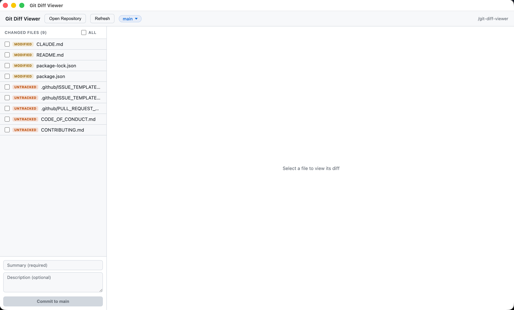

# Git Diff Viewer

A minimal, lightweight GitHub Desktop-style app for browsing git repositories, viewing diffs, and making commits. Built with Electron.

Built originally for Ubuntu/Linux, where [GitHub Desktop is not officially supported](https://github.com/desktop/desktop/issues/1525). Works on macOS and Windows too.



## Features

- **Open any git repository** via folder picker or recent repos list
- **View changed files** — modified, staged, untracked, deleted, renamed
- **Unified diff view** with syntax-highlighted additions and deletions
- **Stage/unstage files** — checkboxes to toggle individual files or select all
- **Commit** — summary + description fields, commits to current branch
- **Branch switching** — dropdown with search/filter, switch between local branches
- **Create branches** — type a new name in the branch dropdown to create and switch
- **Real-time file watching** — sidebar auto-refreshes when files change on disk
- **Resizable sidebar** — drag the handle to adjust the file list width
- **Recent repositories** — quick access to previously opened repos
- **Window state persistence** — remembers size, position, and maximized state
- **Keyboard shortcuts** — `Ctrl+O` to open a repository

## Install

Download the latest release for your platform from [Releases](https://github.com/sameerjoshi/git-diff-viewer/releases).

### macOS

1. Download `Git Diff Viewer-<version>-arm64.dmg`
2. Open the `.dmg` and drag the app to Applications
3. On first launch, right-click → Open to bypass Gatekeeper (the app is ad-hoc signed)

### Windows

1. Download `Git Diff Viewer Setup <version>.exe`
2. Run the installer — it will install and launch automatically

### Linux (Ubuntu/Debian)

```bash
sudo dpkg -i git-diff-viewer_<version>_arm64.deb
```

### From source

```bash
git clone https://github.com/sameerjoshi/git-diff-viewer.git
cd git-diff-viewer
npm install
npm start
```

## Build

Build packages for your platform:

```bash
npm run build        # Linux (.deb)
npm run build:mac    # macOS (.dmg)
npm run build:win    # Windows (.exe)
```

Cross-platform builds may require additional tools — see the [electron-builder docs](https://www.electron.build/multi-platform-build).

## Tech Stack

- [Electron](https://www.electronjs.org/) — desktop shell
- [simple-git](https://github.com/steveukx/git-js) — git operations
- [chokidar](https://github.com/paulmillr/chokidar) — file watching for real-time updates
- Vanilla HTML/CSS/JS — no framework, no build step

## Project Structure

```
├── main.js             # Electron main process (IPC handlers, file watcher, window management)
├── git-helpers.js      # Pure business logic (file status dedup, recent repos, diffs)
├── git-helpers.test.js # Unit tests (Jest)
├── preload.js          # Context bridge (secure API exposure to renderer)
├── index.html          # UI (single file: markup, styles, renderer JS)
├── build/              # App icons (png, icns, ico)
├── package.json        # Dependencies and build config
└── LICENSE             # MIT
```

## Contributing

See [CONTRIBUTING.md](CONTRIBUTING.md) for development setup and guidelines.

## License

[MIT](LICENSE)
